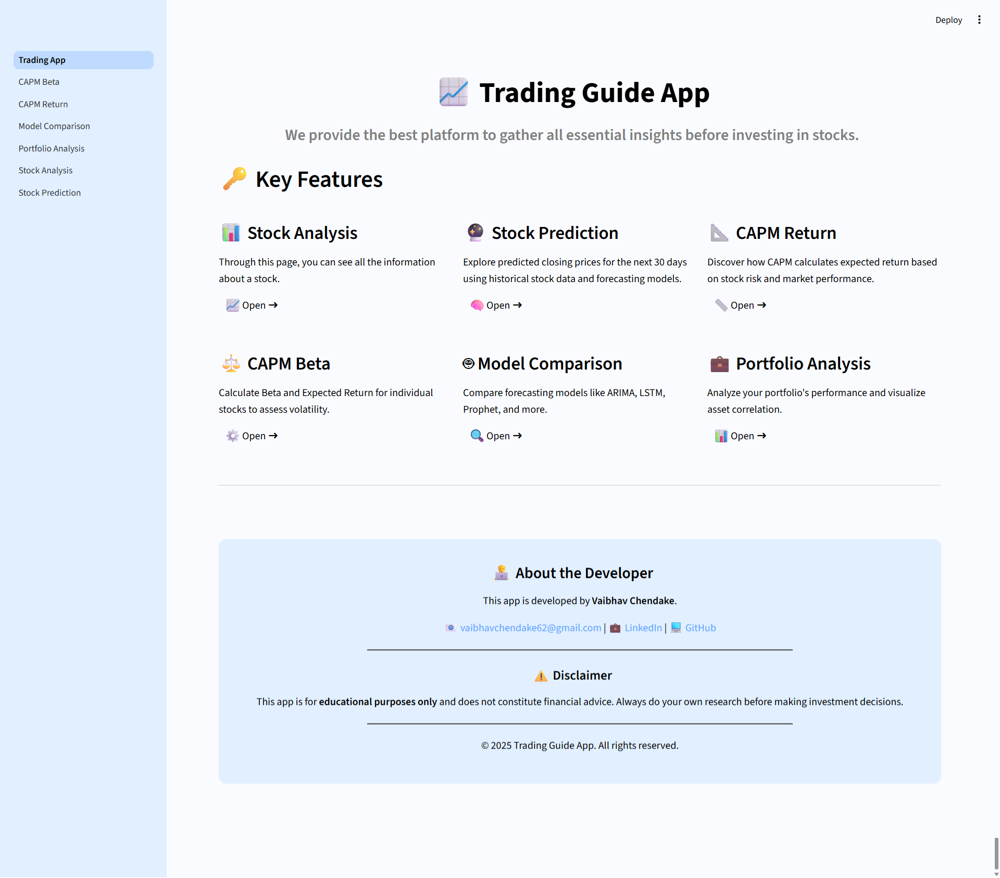
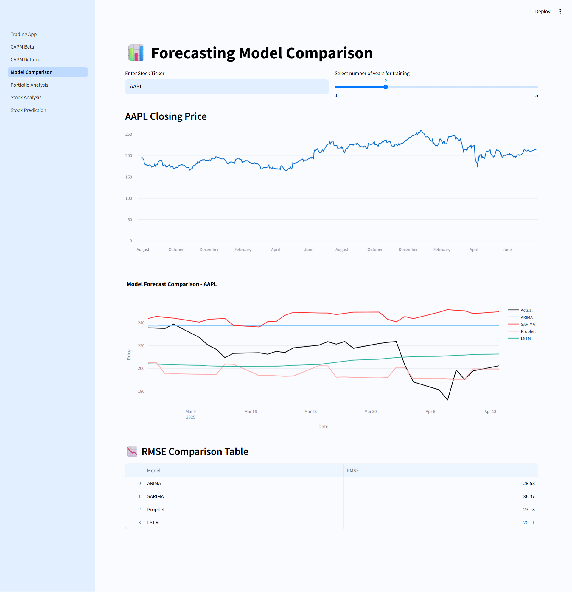
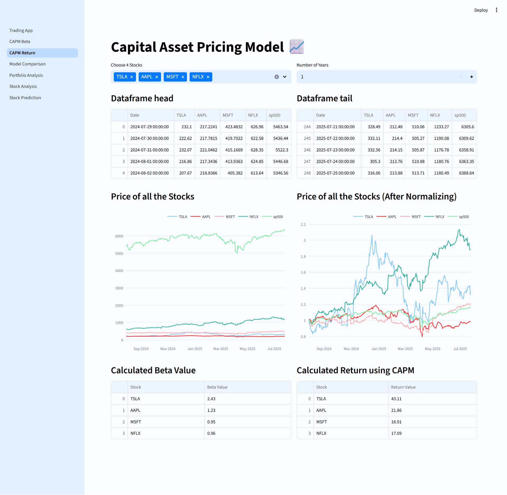
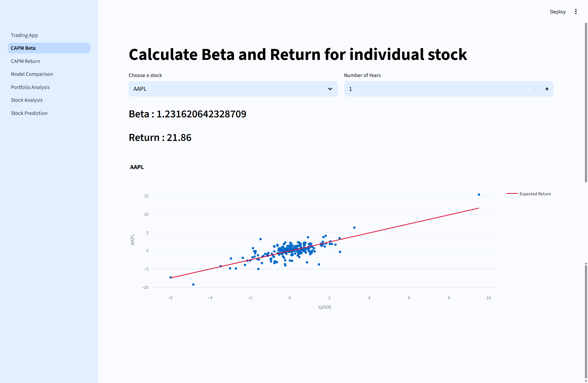

# 📈 Trading Guide App

A **Streamlit-based stock analysis and forecasting web application** that integrates real-time financial data with statistical and machine learning models to support smarter investment decisions.

---

## 🚀 Features

- 🔍 **Stock Analysis**
  - View stock information, candlestick charts, Moving Averages, RSI, and volume data.
  
- 📊 **Stock Prediction**
  - Forecast next 30 days of stock prices using:
    - ARIMA
    - SARIMA
    - Prophet
    - LSTM (Deep Learning)

- 📈 **Model Comparison**
  - Visual comparison of forecasting models based on **RMSE** and predicted trends.

- 💼 **Portfolio Analysis**
  - Upload a portfolio of stocks and analyze:
    - Cumulative returns
    - Daily returns
    - Correlation heatmap

- ⚖️ **CAPM Beta & Return**
  - Calculate **Beta** and **Expected Return** using the **Capital Asset Pricing Model** for up to 4 stocks.

- 📐 **Single-Stock Beta Calculation**
  - Perform regression to compute Beta of a stock against a market index (e.g., NIFTY50).

---

## 🛠 Tech Stack

- **Frontend/UI**: Streamlit
- **Data**: yfinance, pandas, numpy
- **Visualization**: Plotly, Matplotlib, Seaborn
- **Forecasting Models**:
  - ARIMA/SARIMA - statsmodels
  - Prophet - facebook/prophet
  - LSTM - TensorFlow / Keras
- **Metrics**: RMSE from sklearn

---

## 📂 Project Structure

```
Trading-Guide-App/
│
├── Home.py                 # App homepage
├── Stock_Analysis.py       # Stock data and indicators
├── Stock_Prediction.py     # Time series forecasting
├── Portfolio_Analysis.py   # Portfolio comparison
├── CAPM.py                 # Multi-stock CAPM
├── Calculate_Beta.py       # Single-stock beta
├── Model_Comparison.py     # RMSE & model evaluation
├── assets/                 # Images and logos
├── requirements.txt
└── README.md
```

---

## 📸 Screenshots

| Home Page | Stock Analysis | Stock Forecast |
|-----------|----------------|----------------|
|  |  |  |

| Portfolio | Model Comparison | CAPM |
|-----------|------------------|------|
|  |  |  |  |

---

## 🔧 How to Run

1. Clone the repository:
   ```bash
   git clone https://github.com/Vaibhavck18/Trading-Guide-App.git
   cd trading-guide-app
   ```

2. Install dependencies:
   ```bash
   pip install -r requirements.txt
   ```

3. Run the Streamlit app:
   ```bash
   streamlit run Trading_App.py
   ```

---

## 🎯 Future Enhancements

- User login and portfolio saving
- Sentiment analysis using news/Twitter
- Strategy backtesting and signal generation
- Full deployment to Streamlit Cloud / AWS

---

## 📚 References

- [yfinance API](https://pypi.org/project/yfinance/)
- [Streamlit Docs](https://docs.streamlit.io/)
- [Facebook Prophet](https://facebook.github.io/prophet/)
- [Investopedia – CAPM](https://www.investopedia.com/terms/c/capm.asp)
- [TensorFlow LSTM Guide](https://www.tensorflow.org/)

---

## 🙋‍♂️ Developed By

**Vaibhav Chendake**  
📧 vaibhavchendake62@gmail.com

> ⚠️ This app is for educational purposes only and does not provide financial advice.
